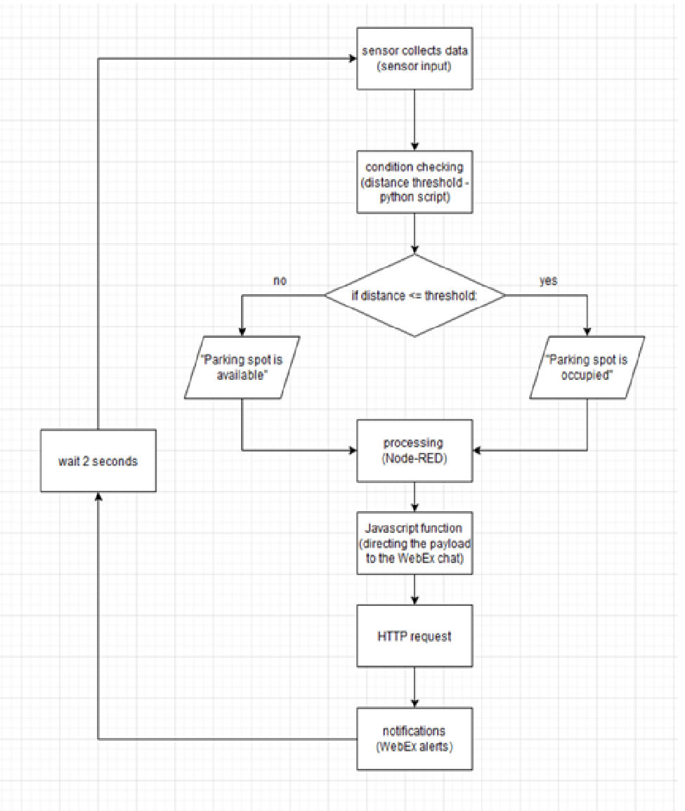
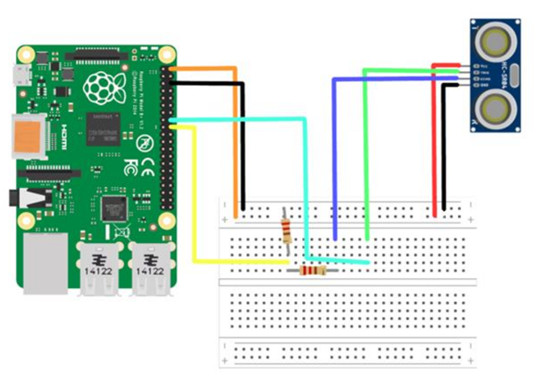

# IoT Smart Parking

A parking spot monitoring system using a **Raspberry Pi**, an **HC-SR04 ultrasonic sensor**, and **MQTT** communication.  
The program measures the distance and publishes the parking spot status (`occupied` / `available`) to an MQTT broker in JSON format.

---

## Block diagaram


---

## 🛠 Requirements
- Raspberry Pi (e.g. 3B/4)
- HC-SR04 ultrasonic sensor
- Python 3
- Installed libraries:
  ```bash
  pip install RPi.GPIO paho-mqtt
  ```
---

## Wiring
 - **TRIG** -> GPIO 23 (pin 16)
 - **ECHO** -> GPIO 24 (pin 18)
 - **VCC** -> 5V
 - **GND** -> GND



--- 

## How to run

1. Start MQTT broker 
```bash
mosquitto
```

2. Clone this repository 
```bash 
git clone https://github.com/vbnxx/IoT-Smart-Parking
```

3. Run this script
```bash
python3 script.py
```

---

## MQTT Data 
This script publishes messages to:
 - **Topic**: `parking/sensor`
 - **JSON format**: 
     ```json
     {
        "status": "Parking spot 5 is occupied",
        "distance": 102.7
     }
      ```
---

## Stopping the Program 

Press `Ctrl+C` to stop  
The script will automatically clean up GPIO pins and disconnect from the MQTT broker.

       